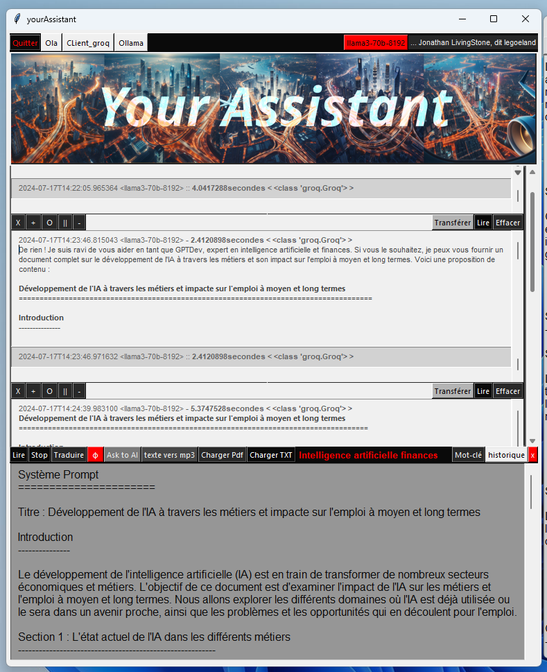
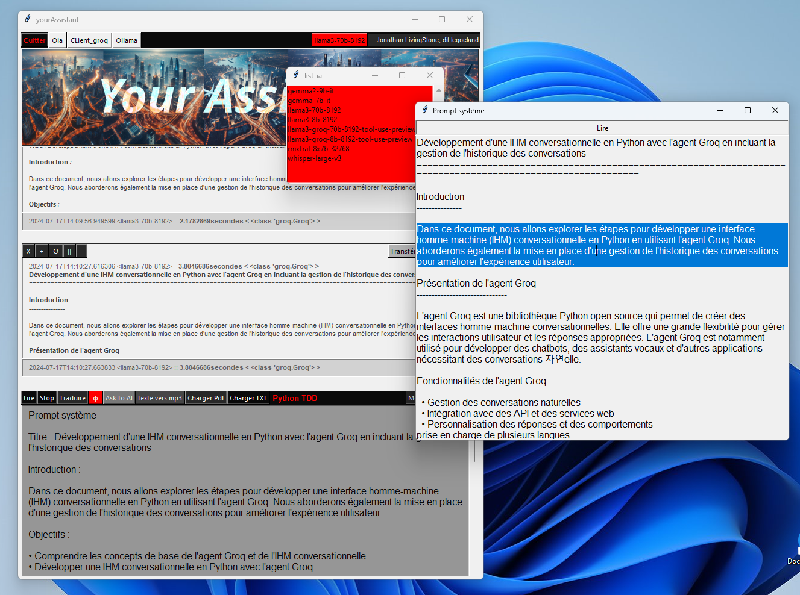
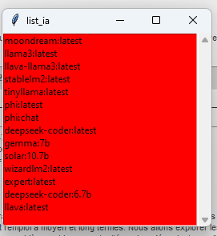
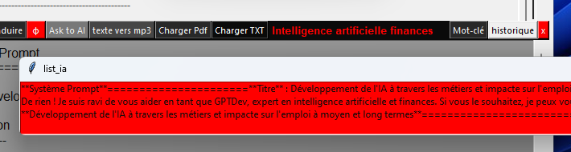

# YourAssistant

**Assistant conversationnel** 
Gestion de l'historique des conversations sur la session en cours (en RAM)

# Use your local offline AI models
**using ollama server**

# Use Groq api for online Ai Models
like llama-8b-8192, llama-70b-8192

**Functionalities**

* **listen**
  
    -> "salut"
  
    AI: "bonjour comment allez vous !"
   
* **speak**

    -> "Lis moi le contenu de ta dernière recherche"
  
    AI: "voici le contenu de ma dernière recherche : ...."
  
* **translate** (from *many* fo FR)
  
    -> click translate_button
  
    AI: texte traduit
  
* **_to_audio** (from txt to mp3)
  
    -> "transformation vers un fiohier mp3"
  
    AI: transformation terminée
  
* **loading TXT and PDF files**
  
    -> click importer un fichier TXT/PDF
  
    AI: "importation terminéee"
  
* **systemical prompts**
  
    -> click spéciality_button
  
  or
  
    -> "prépare moi un prompte sur ....."
  
  AI: résultat, un prompt prêt à l'emploi sur un LLM
  
* **web searching**
  
    -> "rechercher sur le web : something"
  
    AI : using google-search with an API-KEY
  
* **news scrapping from rrs feeds**
  
    -> "Afficher les actualités"
  
    AI : showing a window with list of actuality's categories
  
      the corresponding feed will be got when clicking in the list
  
**TODO**
Relier la gestion de l'historique à une base de données.
Etat des lieux : un résumé des anciennes conversation se lance automatiquement au bout de 15 discussions.

# Exemples
## DevSecOps

**DevSecOps : une pratique pour sécuriser le développement de logiciels**

DevSecOps est une pratique qui vise à intégrer la sécurité dans chaque étape du processus de développement de logiciels. Cela inclut des outils et des processus qui encouragent la collaboration entre les équipes de développement, de sécurité et d'opérations pour livrer des applications plus sécurisées et plus fiables.

**Exemples de DevSecOps**
prompt : rechercher sur le web : DevSecOps

Voici quelques exemples de DevSecOps :

1. **Static Analysis Security Testing (SAST)** : analyse statique du code pour détecter les vulnérabilités de sécurité.
2. **Dynamic Analysis Security Testing (DAST)** : analyse dynamique du code pour détecter les vulnérabilités de sécurité.
3. **Crowdsourced pen testing** : test d'intrusion effectué par des experts en sécurité pour identifier les vulnérabilités de sécurité.
4. **CI/CD Pipeline** : pipeline de intégration continue et de livraison continue qui inclut des étapes de sécurité pour s'assurer que les applications sont sécurisées avant leur mise en production.

**Exemples de DevSecOps dans différents domaines**

Voici quelques exemples de DevSecOps dans différents domaines :

1. **Industrie financière** : utilisation de la sécurité DevOps pour protéger les applications bancaires et les données sensibles.
2. **Industrie de la santé** : utilisation de la sécurité DevOps pour protéger les données de santé et les applications de soins de santé.
3. **Industrie du commerce électronique** : utilisation de la sécurité DevOps pour protéger les applications de commerce électronique et les données des clients.

**Ressources pour en savoir plus sur DevSecOps**

Voici quelques ressources pour en savoir plus sur DevSecOps :

* [Video] [Introduction to DevSecOps](https://www.youtube.com/watch?v=ipe08lFQZU8)
* [Article] [5 Real-World Applications + Examples of DevSecOps](https://www.securityengineering.dev/applications-of-devsecops-with-examples/)
* [GitHub] [DevSecOps Example Hello World](https://github.com/boozallen/devsecops-example-helloworld/)

N'hésitez pas à me poser d'autres questions sur DevSecOps !

## CapGemini
**Analyse de la société Capgemini**

Grâce à la recherche sur le web, nous avons pu avoir un aperçu détaillé de la société Capgemini, un leader mondial dans la transformation digitale.

**Historique**

Créée en 1967 par Serge Kampf sous le nom de Sogeti, l'entreprise a connu une croissance rapide et s'est développée pour devenir l'un des leaders mondiaux dans la transformation digitale. En 2000, Sogeti a fusionné avec Cap Gemini et Ernst & Young Consulting pour former Capgemini.

**Domaines d'expertise**

Capgemini offre une array de services intégrés qui combinent la technologie avec une expertise métier pour aider les entreprises à atteindre leurs objectifs. Les domaines d'expertise de l'entreprise incluent :

* La transformation digitale
* L'informatique en nuage
* L'applications métier
* La gestion de la chaîne d'approvisionnement
* L'analytique et l'intelligence artificielle
* Le cybersecurity
* Et bien d'autres

**Chiffres clés**

* Plus de 270 000 employés dans plus de 50 pays
* Chiffre d'affaires annuel de plus de 14 milliards d'euros
* Plus de 200 sociétés clientes parmi les 500 premières entreprises mondiales

**Récompenses et reconnaissance**

* Classée parmi les 10 meilleures entreprises de services informatiques au monde par le Gartner Magic Quadrant
* Récompensée pour son leadership dans la transformation digitale et la innovation par de nombreux organismes et publications

**Société et responsabilité**

Capgemini s'engage en faveur d'une croissance durable et responsable, en mettant l'accent sur l'égalité des chances, la diversité et l'inclusion, ainsi que sur la réduction de son impact environnemental.

Voilà les résultats de ma recherche sur la société Capgemini !

## Actualités Tech
** Résumé des actualités Tech **

**Ventes et RUME**

* Christie's vend un Apple-1
* GitLab cherche à se vendre
* Ctera lève des fonds et change d'actionnaire
* Kaspersky abandonne le marché US
* Datacore lève 60 M$
* Oracle clôture un procès pour collecte et vente de données personnelles pour 115 M$

** IA et Machine Learning **

* Samsung acquiert Oxford Semantic, spécialiste de l'IA
* Meta prêt à acquérir 5% d'EssilorLuxottica
* Codestral Mamba 7B, petit modèle de Mistral AI pour générer du code
* GPT-4o mini, un LLM multimodal petit mais costaud
* Genkit de Google maintenant taillé pour des développements GenIA en Go
* Salesforce infiltre son meilleur agent GenAI dans Service Cloud
* L'IA générative ne résoudra pas le problème de la migration vers le cloud
* L'IA tire les dépenses IT selon le Gartner
* Red Hat pousse d'un cran la sécurité dans la v4.16 d'OpenShift

**Cloud et Infrastructures**

* JuiceFS, un système de fichiers distribué optimisé pour le cloud
* AWS lance les instances Graviton4
* Avec le cloud, Porsche sécurise ses activités web
* Box nomme Samantha Wessels vice-présidente EMEA
* Comment Microsoft fait grandir Azure Functions
* AWS lève le voile sur son infrastructure réseau d'IA
* Hammerspace étend son orchestration des données à S3

**Sécurité et Données**

* Orléans condamnée pour son audiosurveillance algorithmique
* La Commission européenne accuse X de violer le DSA
* Comment TF1 cible plus efficacement ses audiences grâce aux 1st party data
* Il serait temps d'apprendre à mieux gérer les coûts du cloud
* La région Occitanie s'arrache de l'influence des GAFAM

**Entreprises et Nominations**

* Thomas Gourand à la tête de Snowflake France
* Guillaume Lannebère, Betclic : « Nous sortons complètement du on-premise d'ici fin 2024 »
* Entretien Jean-Christophe Morisseau, DG d'ISG Lenovo France : « L'IA demande de repenser la salle machine »
* SoftBank croque Graphcore et ses accélérateurs IA
* CMA CGM s'allie à Pasqal dans l'informatique quantique
* Nicolas Lautier nommé DSI adjoint de l'ANSM
* Sophie Dionnet nommée vice-présidente des équipes produits de Dataiku

**Autres**

* Un appel à projets sur les usages de l'IA dans le recrutement
* L'Autorité de la concurrence lance une alerte sur l'IA
* L'Opco 2i nomme Cédric Ravier au poste de DSI
* L'Andra refond son IT pour plus de collaboration avec les métiers

**TF1 et la ciblage efficace de ses audiences grâce aux 1st party data**

TF1, l'un des principaux groupes de médias français, s'efforce de cibler de manière plus efficace ses audiences en utilisant les données de premier niveau (1st party data). Voici comment ils le font :

### Collecte des données

TF1 collecte des données sur ses utilisateurs via ses différentes plateformes numériques, notamment son site web, ses applications mobiles et ses réseaux sociaux. Ces données comprennent des informations telles que les préférences de contenus, les habitudes de navigation, les recherches effectuées, etc.

### Utilisation des données pour la publicité ciblée

TF1 utilise ces données collectées pour proposer des publicités ciblées et pertinentes à ses utilisateurs. Grâce à l'analyse de ces données, TF1 peut identifier les groupes cibles spécifiques pour les annonceurs, ce qui leur permet de toucher leur public ciblé de manière plus efficace.

### Création de profils d'audience

TF1 crée des profils d'audience détaillés en reliant les données collectées à des informations supplémentaires telles que l'âge, le sexe, la localité, les centre d'intérêt, etc. Cette approche permet de créer des profils d'audience précis et détaillés, permettant ainsi aux annonceurs de cibler leurs publicités de manière plus efficace.

### Utilisation de la technologie de ciblage avancée

TF1 utilise des technologies de ciblage avancées telles que la reconnaissance de l'appareil (device recognition) et la gestion de la fréquence de-publicité (frequency capping) pour s'assurer que les publicités sont diffusées de manière efficace et non intrusive.

### Intégration avec les plateformes de gestion de la relation client (CRM)

TF1 intègre ses données avec les plateformes de gestion de la relation client (CRM) des annonceurs pour proposer des expériences plus personnalisées et ciblées.

### Résultats attendus

Grâce à l'utilisation des 1st party data, TF1 espère améliorer la pertinence de ses publicités et augmenter la fréquence d'achat des annonceurs. De plus, cette approche permet de proposer des expériences plus personnalisées et plus efficaces pour les utilisateurs.

### Exemple concret

Par exemple, si un utilisateur a consulté régulièrement des vidéos de sport sur le site web de TF1, les systèmes de ciblage de TF1 pourront identifier ce comportement et proposer des publicités ciblées pour des événements sportifs ou des marques de sport.

En résumé, TF1 utilise les 1st party data pour collecter des informations sur ses utilisateurs, créer des profils d'audience détaillés et proposer des publicités ciblées et pertinentes. Cette approche permet d'améliorer l'efficacité des campagnes publicitaires et d'offrir des expériences plus personnalisées aux utilisateurs.

**Sources** :

* [TF1 - " Comment nous utilisons vos données"](https://www.tf1.fr/a-propos-de-tf1/mentions-legales/comment-nous-utilisons-vos-donnees)
* [Adweek - "How TF1 Is Using First-Party Data to Improve Ad Targeting"](https://www.adweek.com/digital/tf1-first-party-data-ad-targeting/)
* [ MédiaNews - "TF1 et la ciblage publicitaire : comment utiliser les données pour améliorer l'efficacité des campagnes"](https://www.medianews.fr/tf1-et-la-ciblage-publicitaire-comment-utiliser-les-donnees-pour-ameliorer-lefficacite-des-campagnes/)
