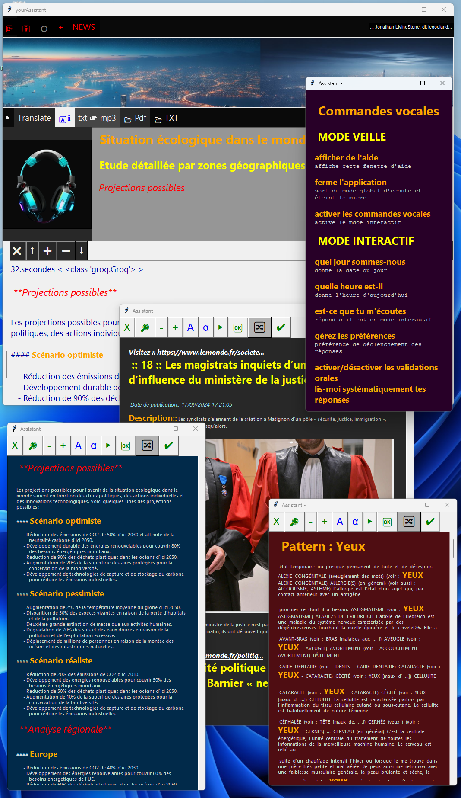

# YourAssistant (my_assistant)

Assistant IA de bureau en **Python / Tkinter** : chat multi-modèles, commandes vocales,
veille d'actualités et recherche web — le tout pilotable à la souris **ou à la voix**.



## ✨ Fonctionnalités

### 💬 Chat multi-IA
- **Groq** (défaut : `llama3-70b-8192`), **Ollama** (modèles locaux listés à la volée), **Gemini** (traduction, synonymes)
- Historique de conversation avec **résumé automatique** des anciennes discussions (à partir de 15 conversations)
- **Mode débridé** (activable vocalement ou par pré-prompt)
- Zone de saisie Markdown, réponses affichées en Markdown

### 🎤 Commandes vocales (mode veille → mode audio)
- **Mode veille** : écoute permanente, ne réagit qu'aux phrases de commande
- **Mode audio** : conversation 100 % vocale (validation orale des prompts, lecture des réponses)
- Reconnaissance : **faster-whisper** (`vocal_stt.py`, VAD arecord) — voir la section Prérequis vocaux plus bas
- Synthèse : **piper** (serveur local :5000) + lecture `aplay`

### 📰 Actualités & recherche web
- **Flux RSS** : Le Monde (toutes rubriques), Le Monde Informatique, L'Informé, Google News (recherche)
- **NewsAPI** : recherche d'articles par sujet (domaines ciblés)
- **Recherche web** intégrée au prompt : « rechercher sur le web : … » (Google Custom Search)
- Affichage enrichi : titres, images, liens cliquables, traduction automatique

### 🧠 Pré-prompts & rôles (bouton 📌)
Spécialité (programme de formation) · Spécialiste (exposé détaillé) · Promptor (créateur de prompts) · E-mail writer · Critique & notation ⭐ · Traducteur · Formateur · Débateur · Product Owner (plan d'action) · Scrum (todo + sprints) · Fiche de poste · Veille de contenu · Recherche web · Correcteur web · Reverse prompt

### 🔄 Traduction
- Bouton **Translate** : traduction sur place du texte sélectionné (Gemini `gemini-flash-latest`)
- Traduction automatique des articles d'actualité

### 💾 Exports & imports
- **PDF** (conversation), **MP3** (texte → voix, via piper + ffmpeg), **TXT / MD / HTML**
- Chargement de fichiers **TXT** et **PDF** dans le prompt
- Journal automatique des réponses : `ai.resume_web.{md,txt,html}` + `index.html`

### ⚙️ Personnalisation
Pseudo, nombre de mots minimum pour déclencher une réponse, validation orale des prompts, lecture orale des réponses, choix du modèle IA.

## 🖥️ Prérequis vocaux

La fonctionnalité vocale repose sur l'écosystème local du poste (indépendant du venv du projet) :

| Brique | Rôle | Emplacement |
|---|---|---|
| **piper** (TTS) | Synthèse vocale, voix `fr_FR-miro-high` | Serveur HTTP `http://localhost:5000` (`piper.http_server`) |
| **faster-whisper** (STT) | Transcription (modèle `Systran/faster-whisper-base`) | Env `~/piper/piper_env` |
| **arecord / aplay** | Capture / lecture audio | Système (ALSA) |
| **Micro USB** | Capture (VAD) | `plughw:CARD=U20,DEV=0` (configurable dans `outils.py`) |

Lancement du serveur TTS (déjà en place sur le poste de travail) :
```sh
~/piper/piper_env/bin/python3 -m piper.http_server \
    -m ~/piper/fr_FR-miro-high.onnx --length_scale 0.75
```

## 🔑 Configuration (clés API)

Les clés sont chargées depuis **`~/.config/api_keys.env`** (source unique, format `NOM=VALEUR`)
via `secret.py` — ce fichier est **gitignoré**, ne jamais y mettre de secret en dur dans le code.

Variables utilisées par le projet :
`GROQ_API_KEY` · `GEMINI_API_KEY` · `GOOGLE_API_KEY` · `GOOGLE_CSE_ID` · `NEWS_API_KEY` · `PROJECT_NUMBER`

## 📦 Installation

```sh
# 1. Environnement Python 3.12
python3 -m venv assistant
assistant/bin/pip install -r requirements.txt

# 2. Clés API (voir ci-dessus)
nano ~/.config/api_keys.env

# 3. Écosystème vocal (voir prérequis vocaux)
```

## 🚀 Utilisation

### Interface graphique
```sh
python zic_win_chat.py
```
- **Ctrl+Return** : valider le prompt
- Bouton 🎧 : démarrer/arrêter l'écoute (mode veille)

### Mode terminal (raisonnement par étapes)
```sh
python zic_win_chat.py -p "ma question" -m 3 -x 5   # 3 à 5 étapes de raisonnement
python zic_win_chat.py -p "ma question" -t           # + lecture vocale de la réponse
```

### Commandes vocales principales

| Mode veille | Mode audio |
|---|---|
| « passe en mode audio » | « quel jour sommes-nous » / « quelle heure est-il » |
| « afficher de l'aide » | « est-ce que tu m'écoutes » |
| « quel est le mode actuel ? » | « gère les préférences » |
| « active le mode débridé / normal » | « lis-moi systématiquement tes réponses » |
| « ferme l'application » | « afficher l'historique des conversations » |
| | « effacer la dernière conversation » |
| | « donne-moi les infos » / « afficher les actualités » |
| | « faire une recherche web sur … » |
| | « lancer une application » (netflix, gmail, youtube…) |
| | « fin de la session » |

## 📁 Structure du projet

```
zic_win_chat.py          # point d'entrée (GUI ou terminal)
FenetrePrincipale.py     # fenêtre principale + commandes vocales (2925 lignes)
outils.py                # moteur : appels IA, audio, news, fichiers
Constants.py             # constantes, prompts système, flux RSS
Conversation.py          # widget conversation (question/réponse)
SimpleMarkdownText.py    # zone de texte Markdown
GrandeFenetre.py         # fenêtre agrandie (actus, réponses, PDF)
FenetreScrollable.py     # zone scrollable des conversations
RechercheArticles.py     # affichage des articles NewsAPI
Article.py               # modèle d'article
lire_text.py             # TTS (piper :5000) + traduction Gemini
vocal_stt.py             # STT faster-whisper (VAD arecord)
my_feedparser_rss.py     # flux RSS (Le Monde, LMI, L'Informé, Google News)
my_search_engine.py      # recherche web (Google CSE)
my_grep.py               # extraction par mots-clés dans un texte
PdfMaker.py              # export PDF
StoppableThread.py       # threads arrêtables
secret.py                # chargement des clés (~/.config/api_keys.env)
```

## 🗂️ État / TODO

- ⏳ Relier la gestion de l'historique à une **base de données** (actuellement en mémoire, avec résumé automatique des anciennes conversations)
- ⏳ Test auditif complet du cycle vocal après migration piper/faster-whisper

## 📜 Licence

Projet sous licence **MIT** (fichier LICENSE à ajouter).
